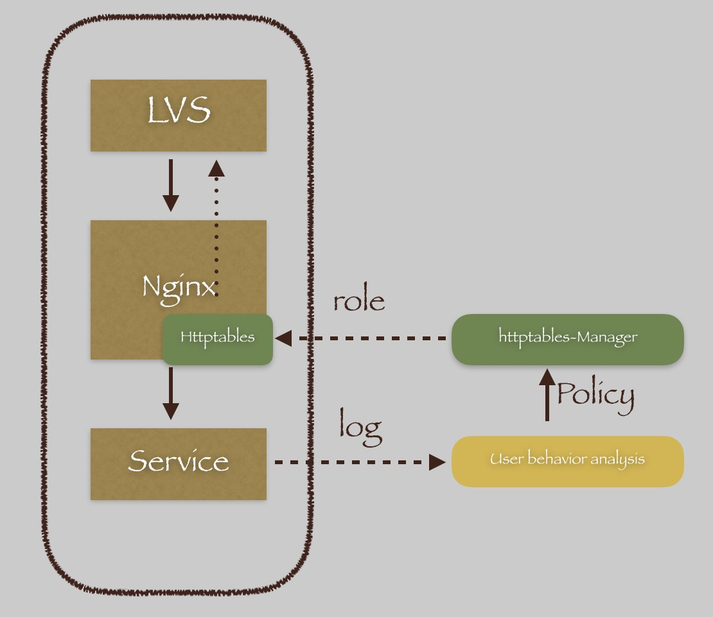

# httptables (just like Linux's iptables)
httptables is a based on the [OpenResty](https://openresty.org/en/), kind of a firewall for http requests based on headers. It parses a set of rules for each HTTP header and apply the matching policy. Policy using Restful interface management, easy enough to integration with the third party system(User behavior analysis system).


Design details please click [OUTLINE.md](doc/OUTLINE中文版.md)。

## Deployment diagram

* [Httptables](https://github.com/WALL-E/httptables): implemented
* [Httptables-Manager](https://github.com/WALL-E/httptables-manager): implemented
* User-Behavior-Analysis: not implemented



## World views 
In her world, each client has three separate identity, and each is unique

* `Origin` The source address of client
* `User`   The User ID
* `Device` The Device ID

The User and Device, retrieve from request's header, you can customize the **getattr** function, [see more](doc/lamda.md)

* NB: This module makes the assumption your request contain two headers like this

  ```
  X-Device-ID: device_1
  X-User-ID: user_1
  ``` 
 
## Features
Support the following features

* circuit breakers
  * **Reject** Blocking the user requests, return the response of custom content
* speed bump
  * **Defer** SLowing down of the request of the user

## Install
Please click [INSTALL.md](doc/INSTALL.md) to view the installation documentation

## Integration with httptables-manager
open lua/config.py and modify the contents of the `httptables-manager-ip`

```
_M.http_endpoint.role_types = "http://httptables-manager-ip:8080/apis/role_types/"
_M.http_endpoint.roles = "http://httptables-manager-ip:8080/apis/roles/"
```

# Copyleft
Thank you for the following open source projects


* OpenResty

  <span id="OpenResty">[OpenResty](https://openresty.org/en/)™</span> is a full-fledged web platform by integrating the standard Nginx core, LuaJIT, many carefully written Lua libraries, lots of high quality 3rd-party Nginx modules, and most of their external dependencies. It is designed to help developers easily build scalable web applications, web services, and dynamic web gateways.

* Kong

  [Kong](http://www.getkong.org/) is a scalable, open source API Layer (also known as an API Gateway, or API Middleware). Kong runs in front of any RESTful API and is extended through Plugins, which provide extra functionalities and services beyond the core platform.

